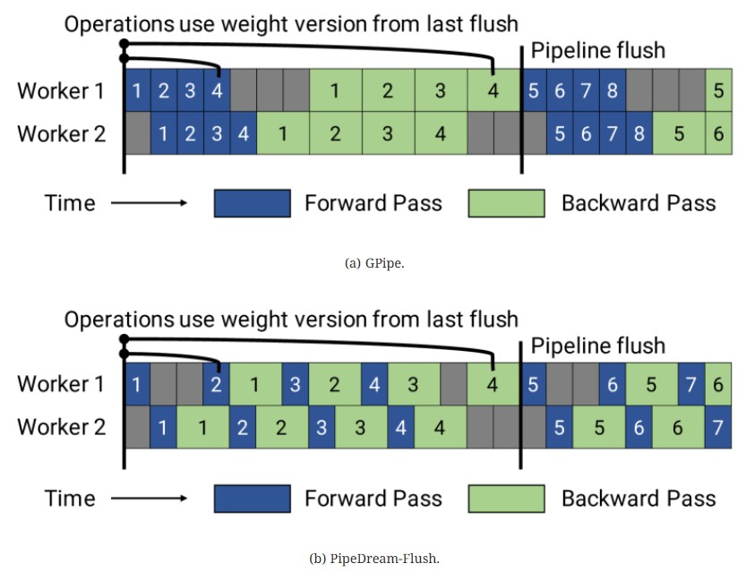
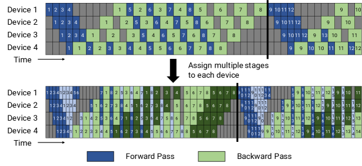
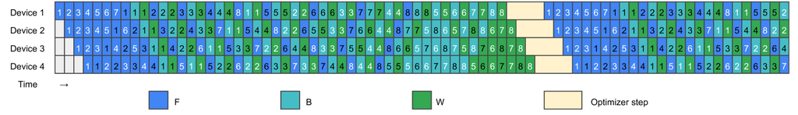
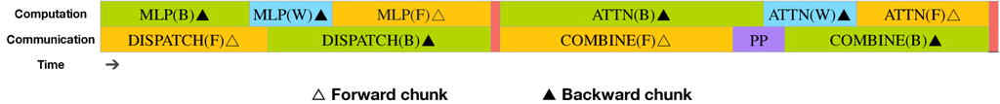
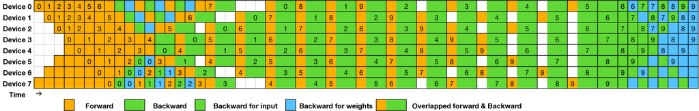
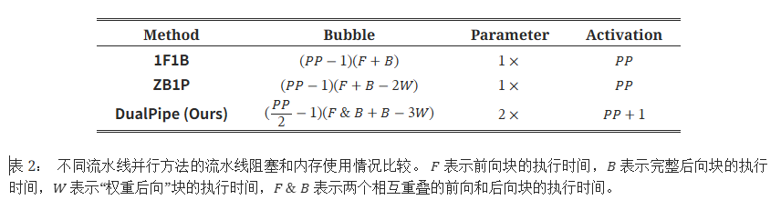

# Pipeline Parallelism发展历程
 
 # 1、 Gpipe
 
 - [论文链接-EN](https://arxiv.org/pdf/1811.06965)
 - [论文链接-CN](https://yiyibooks.cn/arxiv/1811.06965v5/index.html)
 
 &nbsp;&nbsp;&nbsp;&nbsp;&nbsp;&nbsp;&nbsp;&nbsp;在前向传递过程中，GPipe首先将大小为N的每个小批量数据划分为M个相等的微批量数据，这些微批量数据通过K个加速器进行流水线处理。 在反向传递过程中，每个微批次的梯度是基于与前向传递中使用的相同模型参数计算的。 在每个小批量数据结束时，所有M个微批次的梯度都会被累积并应用于更新所有加速器上的模型参数。 此操作序列如图(c)所示。` `
 
 
 
 图 (a) 一个示例的神经网络，具有连续的层，被分割到四个加速器上。 $F_{k}$ 是第k个单元的组合前向计算函数。 $B_{k}$ 是反向传播函数，它依赖于来自上一层的 $B_{k+1}$ 和 $F_{k}$ 。(b) 朴素的模型并行策略由于网络的顺序依赖关系导致严重的低利用率。(c) 流水线并行将输入的mini-batch分割成较小的micro-match，使得不同的加速器可以同时处理不同的micro-batch。梯度在最后同步应用。` `
 
 **① 核心思想**：
 整个前向做完再去做反向，这样就会形成很大的**Bubble**，
 所有的反向做完才做参数的更新，即Update，专业名词**Pipeline-flush**（等所有的micro-batch跑完之后，梯度都累加好之后，再去做统一的梯度更新）。` `
 **② 特点**：
 当micro-batch个数越多，Bubble所占的比例越低，计算效率越高。` `
 **③ 经验**：
 micro-batch总的个数至少是stage的四倍以上。` `
 **④ 图(c)讲解**：
 纵轴是设备device，横轴是时间步step，每个device对应着模型的一个阶段stage。` `
 
 # 2、 PipeDream
 
 - [论文地址-EN](https://arxiv.org/pdf/1806.03377)
 - [论文地址-CN](https://yiyibooks.cn/arxiv/1806.03377v1/index.html)
 
 &nbsp;&nbsp;&nbsp;&nbsp;&nbsp;&nbsp;&nbsp;&nbsp;**①** 与传统的单向流水线不同，流水线式的DNN训练涉及到双向流水线。一个小批量数据的前向传递从**输入层开始**，反向传递在**输入层结束**。因此，在流水线中的每个活跃小批量数据可能位于不同的层，无论是在前向传递还是反向传递中。因此，系统中的每台机器必须在以下两个选项之间进行选择：
 
 1. 执行一个小批量数据的前向传递，从而将该小批量数据推送到下游机器；` `
 2. 为**另一个**小批量数据执行反向传递，从而确保学习中的前进。` `
 
 &nbsp;&nbsp;&nbsp;&nbsp;&nbsp;&nbsp;&nbsp;&nbsp;始终优先考虑前向工作的简单调度机制会阻碍整体的前向进展，因为只有在完成反向传播后才能应用权重更新。同样地，始终优先考虑后向工作可能会导致周期性地存在空闲机器没有可用工作。我们提出了一种避免这些问题的调度机制。` `
 
 &nbsp;&nbsp;&nbsp;&nbsp;&nbsp;&nbsp;&nbsp;&nbsp;在启动阶段，输入阶段允许NOAM小批量以保持流水线处于稳定状态。一旦进入稳定状态，**每个阶段(stage)会交替执行小批量的前向传播和后向传播。我们称这种机制为一前一后（1F1B）**。在平衡的流水线中，1F1B确保在稳定状态下没有GPU处于空闲(idle)状态，并且我们从每个小批量中取得学习的前进。` `
 
 
 
 **②** 图8展示了一个具有4个阶段的流水线在每个阶段上运行于一台机器的计算时间轴。此配置的NOAM为4。在**启动阶段**，输入阶段接受了恰好四个小批量，并将它们传播到输出阶段。**一旦输出阶段完成了第一个小批量的前向传播，它就会进行相同小批量的后向传播，并开始交替执行后续小批量的前向传播和后向传播**。随着后向传播开始向流水线中的较早阶段传播，每个阶段开始交替执行不同小批量的前向传播和后向传播。如图所示，在稳定状态下，每台机器要么在进行小批量的前向传播，要么在进行小批量的后向传播，保持忙碌。对于1F1B要发挥作用，前向传播的时间不一定要与后向传播的时间相同。事实上，实践中我们观察到后向传播总是比前向传播时间长，而1F1B仍然是一种有效的调度机制。` `
 
 &nbsp;&nbsp;&nbsp;&nbsp;&nbsp;&nbsp;&nbsp;&nbsp;当阶段(stage)在数据并行配置下运行，并在多个GPU上复制时，我们使用确定性的轮询(round-robin)负载均衡（minibatchID mod stageReplicaID）来将前一阶段的工作分配给复制品。这种确定性的负载均衡确保了对于一个小批量的后向传播是在负责该小批量前向传播的机器上执行的。` `
 
 &nbsp;&nbsp;&nbsp;&nbsp;&nbsp;&nbsp;&nbsp;&nbsp;流水线中阶段的1F1B调度策略和跨复制阶段的轮询(round-robin)负载均衡调度策略都是静态策略。因此，它们可以由每台机器独立执行，无需昂贵的分布式协调。` `
 
 **③ 图8核心思想：**
 纵向machine1、2、3、4分别对应**stage1、2、3、4**，横向step每个**时间步**，
 machine1第一个时间步塞入1号micro-batch，第二个时间步塞入2号micro-batch，第三个时间步塞入3号micro-batch，第四个时间步塞入4号micro-batch，**每个时间步所用到的weight可能不一样**，当machine4做完1号micro-batch的前向后，采用**1f1b**的思想（一个前向一个反向，反向做完就可以释放一部分的activition，是显存节约的一种方式），machine4第二个时间步可以做1号micro-batch的反向也可以做2号micro-batch的前向，它是交叉的来进行的，**有反向就优先做反向，没有就做前向**（这边**实现了Zero Bubble的方式**），后面就没有pipeline-flush，因为**采用了异步更新**的方式，这些micro-batch谁管谁的weight，比如4号batch走到machine3，此时发现1号batch已经做完反向了，此时立刻更新4号它的weight，那么4号就在更新后的weight上继续往下走，在machine3的3号batch用的weight是之前的weight，此时3号和4号用到的weight是**两份不同的weight**，这时候就会**出现weight的冗余**（只是时间不一样，在本论文中**要同时保存，这就是一个致命的缺点**），虽然后期没有bubble但是会多保留weight，**本文工程上不会使用**。` `
 
 # 3、PipeDream-1f1b
 
 - [论文链接-EN](https://arxiv.org/pdf/2006.09503)
 - [论文链接-CN](https://yiyibooks.cn/arxiv/2006.09503v3/index.html)
   
 
 
 - **①、工程上一定会使用带Pipeline flush的**，没有完全实现异步更新（每个micro-batch自己管自己的更新），异步更新在工程上是不太合理的，
 - **②、图（b）中是等4个micro-batch全部做完反向后，统一做更新**，前反向相互交叉进行，最后在同一个weight上面做梯度累加，所有的micro-batch累加完之后，在总的global batch上面去做Pipeline flush参数更新（**这个方式已经在工程上落地了**，在这个落地的情况下，**Megatron-LM在这个基础上又进行了扩展'Interleave-1f1b'**）
 
 
 # 4、Interleave-1f1b（Megatron-LM）
 
 - [论文地址-EN](https://arxiv.org/pdf/2104.04473)
 - [论文地址-CN](https://yiyibooks.cn/arxiv/2104.04473v5/index.html)
 
     
 
 - ①、上半部分的图就是**PipeDream-1f1b中的图（b）**,下半部分就是**Megatron-LM在此基础上改进的Interleave-1f1b，这个方式也在工程上落地了**
 - **②、核心思想：**
 &nbsp;&nbsp;&nbsp;&nbsp;&nbsp;&nbsp;&nbsp;&nbsp;（1）拆stage的时候用了更细粒度的stage，**一张卡上可以包含两个不同的stage**。
 &nbsp;&nbsp;&nbsp;&nbsp;&nbsp;&nbsp;&nbsp;&nbsp;（2）**假设现在有4个Gpu、模型有16层：**
 &nbsp;&nbsp;&nbsp;&nbsp;&nbsp;&nbsp;&nbsp;&nbsp;上面图的切分，每个Device放了4层：
 &nbsp;&nbsp;&nbsp;&nbsp;&nbsp;&nbsp;&nbsp;&nbsp;&nbsp;&nbsp;&nbsp;&nbsp;&nbsp;&nbsp;&nbsp;&nbsp;&nbsp;&nbsp;&nbsp;&nbsp;&nbsp;&nbsp;&nbsp;&nbsp;&nbsp;&nbsp;&nbsp;&nbsp;&nbsp;&nbsp;&nbsp;&nbsp;（0-3层属于stage0，对应Gpu0，放到Device1上）、
 &nbsp;&nbsp;&nbsp;&nbsp;&nbsp;&nbsp;&nbsp;&nbsp;&nbsp;&nbsp;&nbsp;&nbsp;&nbsp;&nbsp;&nbsp;&nbsp;&nbsp;&nbsp;&nbsp;&nbsp;&nbsp;&nbsp;&nbsp;&nbsp;&nbsp;&nbsp;&nbsp;&nbsp;&nbsp;&nbsp;&nbsp;&nbsp;（4-7层属于stage1，对应Gpu1，放到Device2上）、
 &nbsp;&nbsp;&nbsp;&nbsp;&nbsp;&nbsp;&nbsp;&nbsp;&nbsp;&nbsp;&nbsp;&nbsp;&nbsp;&nbsp;&nbsp;&nbsp;&nbsp;&nbsp;&nbsp;&nbsp;&nbsp;&nbsp;&nbsp;&nbsp;&nbsp;&nbsp;&nbsp;&nbsp;&nbsp;&nbsp;&nbsp;&nbsp;（8-11层属于stage2，对应Gpu2，放到Device3上）、
 &nbsp;&nbsp;&nbsp;&nbsp;&nbsp;&nbsp;&nbsp;&nbsp;&nbsp;&nbsp;&nbsp;&nbsp;&nbsp;&nbsp;&nbsp;&nbsp;&nbsp;&nbsp;&nbsp;&nbsp;&nbsp;&nbsp;&nbsp;&nbsp;&nbsp;&nbsp;&nbsp;&nbsp;&nbsp;&nbsp;&nbsp;&nbsp;（12-15层属于stage3，对应Gpu3，放到Device4上）。` `
 &nbsp;&nbsp;&nbsp;&nbsp;&nbsp;&nbsp;&nbsp;&nbsp;下面图Interleave的会有一个变化：每个Device放了4层，但是是**间隔的放**，比如：Device1放了0、1、8、9层，中间有明显的间隔，这个间隔就是用不同颜色来表示的，深蓝色的1号micro-batch进入了Device1里，运行第0和1层，运行后立即把output交给Device2，一直交到Device4结束后，此时总共运行了八层，现在该运行第九层了即第8层，第8层在Device1上（浅蓝色的1号micro-batch），采用Interleave的方式，每张卡上是交错的方式，这样做的好处是：上面图Device1是要运行四层才能把output交给Device2的，但是下面图只需要运行两层就能交给下一个Device，那么图中左边灰色的小方格即Bubble就会减半。` `
 &nbsp;&nbsp;&nbsp;&nbsp;&nbsp;&nbsp;&nbsp;&nbsp;（3）节约Bubble时间，但通讯的次数变多

# 5、zero-Bubble

- [论文地址-EN](https://arxiv.org/pdf/2401.10241)
- [论文地址-CN](https://yiyibooks.cn/arxiv/2401.10241v1/index.html)

  
- 图中**F代表Forward，B代表Activition Backward，W代表Weight Backward**，把Backward拆成了两部分B和W。
- 用 Linear 来举例，这边主打的是 Linear 的Backward，它需要计算两个部分的梯度：activition、weight（Linear前向时是activition * weight = output,做反向时两个都需要计算梯度，区别点在于最终保留的是w的梯度，activition的梯度是为了反向才计算的）（在pytorch里面，前向的一个Linear对应的反向是一个算子还是两个，w的反向和activition的反向释放到一个op里计算的（1个op里有两个matmul来实现的），这个op要等这两个全部计算完才会继续往下执行，**核心思想1：zero-Bubble会把Linear的activition和w做异步，计算activition的反向和计算w的反向分开来进行**）,
- **核心思想2**：图中**Optimizer step**，原来这边是一个**Pipeline-flush**是一条竖线（等所有step都准备好了做更新），比方说Device1上的所有grad都已经计算好了，此时没有必要再等其它Device就可以更新（**Pipeline-flush**现在是折线）

# 6、Dual-pipe

- **DeepSeek提出**
- [论文链接-EN](https://arxiv.org/pdf/2412.19437)
- [论文链接-CN](https://yiyibooks.cn/arxiv/2412.19437v1/index.html)

  

  &nbsp;&nbsp;&nbsp;&nbsp;&nbsp;&nbsp;&nbsp;&nbsp;**图4**： 一对单独的前向和后向块的重叠策略（Transformer块的边界未对齐）。 橙色表示前向，绿色表示“输入的反向”，蓝色表示“权重的反向”，紫色表示流水线并行通信，红色表示屏障。 全对全通信和流水线并行通信都可以完全隐藏。

  ---

  
  &nbsp;&nbsp;&nbsp;&nbsp;&nbsp;&nbsp;&nbsp;&nbsp;**图5**： 8个PP秩和两个方向上20个微批次的DualPipe调度示例。 反向的微批次与正向的微批次对称，为了简化说明，我们省略了它们的批次ID。 由共享黑边包围的两个单元格具有相互重叠的计算和通信。

  ---

- 图中**双向进行**，Device0在进行前向时，同时的Device7也在进行前向。比方说第一个时间步Device0保存的是模型的第0层，那Device7也要保存的是模型的第0层，也就是说Linear0在Device0和Device7都保存了，所以这边的Parameter是两倍
- **DualPipe的关键思想是重叠一对单独的前向和后向块中的计算和通信**。 具体来说，我们将每个块划分为四个组件：注意力（Attention）、全对全调度（All-to-all dispatch）、MLP和全对全组合（All-to-all combine）。 特别地，对于后向块，注意力和MLP进一步被分成两部分，输入的反向和权重的反向，就像在ZeroBubble(Qi et al., 2023b)中一样。 此外，我们还有一个PP通信组件。 如图4所示，对于一对前向和后向块，我们重新排列这些组件并手动调整专用于通信与计算的GPU SM比例。 在这种重叠策略中，我们可以确保在执行过程中所有到所有和PP通信都可以完全隐藏。 鉴于高效的重叠策略，完整的DualPipe调度如图5所示。 它采用双向流水线调度，同时从流水线的两端馈送微批次，并且可以完全重叠很大一部分通信。 这种重叠还确保，随着模型进一步扩展，只要我们保持恒定的计算与通信比率，我们仍然可以在节点之间使用细粒度的专家，同时实现接近零的全部到全部通信开销

- 此外，即使在没有大量通信负担的更一般情况下，DualPipe仍然表现出效率优势。 在表2中，我们总结了不同PP方法的流水线气泡和内存使用情况。 如表所示，与ZB1P(Qi et al., 2023b)和1F1B(Harlap et al., 2018)相比，DualPipe显著减少了流水线气泡，而峰值激活内存仅增加了1/PP倍。 尽管DualPipe需要保留模型参数的两个副本，但这不会显著增加内存消耗，因为我们在训练期间使用了较大的EP大小。 与Chimera(Li and Hoefler, 2021)相比，DualPipe只需要流水线阶段和微批次能够被2整除，而不需要微批次能够被流水线阶段整除。 此外，对于DualPipe，气泡和激活内存都不会随着微批次数量的增加而增加。

 